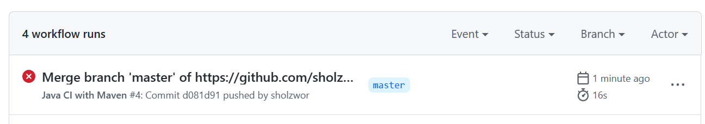

5 pts Your GitHub account showing that is has been forked from the depaulcdm/springpetclinic repository. This doesn’t actually need an image – I can see it
from your repository.

5 pts Your GitHub Actions dashboard showing a successful first build.

5 pts Your GitHub repository with the readme.md file selected showing the code that you
changed to update the badge.

5 pts Your GitHub repository with the readme.md file selected showing the build success
status after you’ve updated the badge markdown.

5 pts The section of the POM file showing the coordinates after you’ve commented them
out.

5 pts Your GitHub Actions dashboard showing the unsuccessful build after the breaking
change.

5 pts Your GitHub repository with the readme.md file selected showing the build failed
status after the GitHub workflow fails.

5 pts The section of the POM file showing the coordinates after you’ve fixed them.

5 pts Your GitHub Actions dashboard showing the successful build after the breaking
change has been fixed.

5 pts Your GitHub repository with the readme.md file selected showing the build success
status after the GitHub workflow has recovered.

